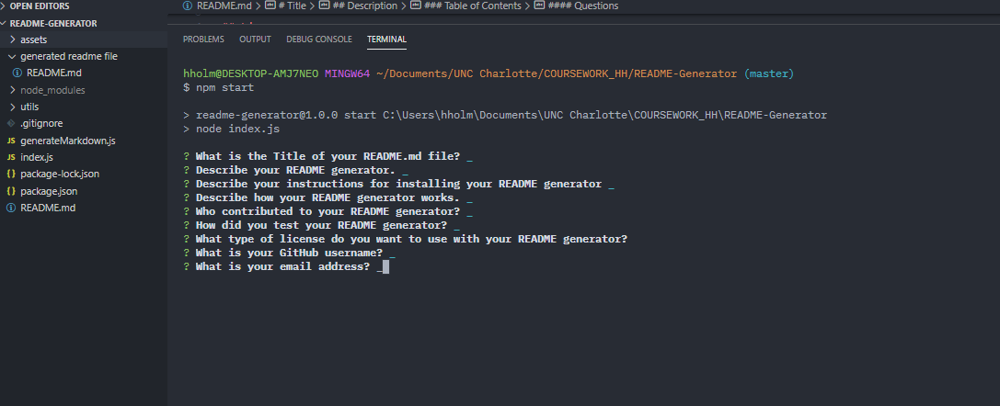

# Title
Hank's README Generator

## License

## Description
My README generator uses JavaScript and Node.js to ask a user important questions about this project, and then once they have finished answering a README file is generated with their responses reflected in the appropriate areas of the file. My motivation for this assignment was to showcase my ability to use JavaScript and Node.js, and to attempt to create a fully developed README.md file without having to manually create said file. While this doesn’t solve a specific problem per se, leveraging JavaScript and Node.js to significantly streamline this process will save users a significant amount of time if/when they need to create this type of file in as little time as possible. In order to get my generator up-and-running, I learned how to use JavaScript to setup the constructor, markdown file layout, and functions for prompting each question and then subsequently applying each answer to the appropriate section of my README.md; I also learned how to use Node.js to initiate my JavaScript without having to use my web browser, and how to install npm, npm init, and npm inquirer. My project stands out because of the polished format of my README.md file (specifically, the headers of my title and sections, and my table of content with anchor links to each corresponding section), and the dynamic label badge at the top of the generated file that reflects the type of license a user chooses.

### Table of Contents
[Installation](#installation)
[Usage](#usage)
[License](#license)
[Contributing](#contributing)
[Tests](#tests)
[Questions](#questions)

#### Installation
In order to get my README generator to work, a user will need to open an integrated terminal in the “README-GENERATOR” folder, enter “npm start” into the command line, and then answer each of the prompted questions.

#### Usage
When a user goes into my “README-GENERATOR” folder, they must open an integrated terminal, install npm and npm inquirer, and then enter “npm start” to initiate the prompted questions. Once a user that answered each of the questions, a completed README.md file is generated containing their responses.

#### License
ms-pl

#### Contributing
I relied on previous in-class activities (specifically, Activity 28 Stu_Mini-Project) while building my generator.

#### Tests
While I didn’t create any tests with Node.js in this assignment, I did test out my code by debugging it until it produced a completed README.md file, and then once this was successful I further polished the layout in my README.md file in index.js.

#### Questions
If you have any questions for me about my README generator, please reach out to me via GitHub at HHH-603 or send me an email at hholmes726@gmail.com.